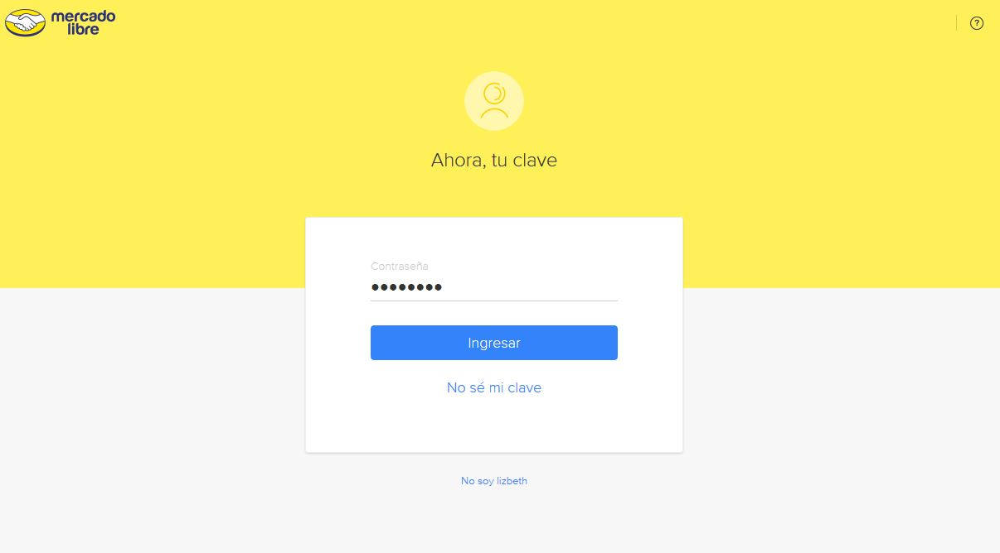

# E-commerce
La página web **Buy Smart** es un e-commerce especializado en la venta de smart phones. Para su desarrollo, se utilizó la API de Mercado Libre para la información e imágenes de los celulares, así como para el inicio de sesión de los usuarios, la API de Paypal para la pasarela de compra y el framework de Materialize para los estilos. Asimismo, se siguió los principios de SPA para los templates del header y cuerpo, así como el enrutamiento de las vistas: el inicio de sesión y la página principal.

## Desarrollado para 
[Laboratoria](http://laboratoria.la)

## Concepto de la app web y flujo

1. El nombre del e-commerce es **Buy Smart**, brinda la opción de ver y comprar smartphones y algunos pocos artículos smart relacionados mediante la presentación de una información enfocada en el nombre del modelo, su costo, disponibilidad y la posibilidad de su costo en cuotas y números de cuotas. 

2. El flujo de la aplicación será de la siguiente forma:

* Página principal que da la bienvenida y le solicita al usuario a iniciar sesión. Al dar clic en el botón de iniciar sesión, se redigirá a la siguiente vista.

* En la vista de iniciar sesión, se solicita ingresar el correo electrónico y en una siguiente vista, se solicita ingresar la contraseña.

* Luego de iniciar sesión, se redirige a la vista principal donde se presentan los productos con su información respectiva. Además, se presenta un botón que le indica al usuario que puede dirigirse a hacer la compra. Esto lo llevará a poder hacer el pago con paypal.

## Herramientas

Para este proyecto, se usó las herramientas tecnológicas de HTML5, Materialize, CSS3, page.js, handlebars, API de mercado libre y API de paypal.